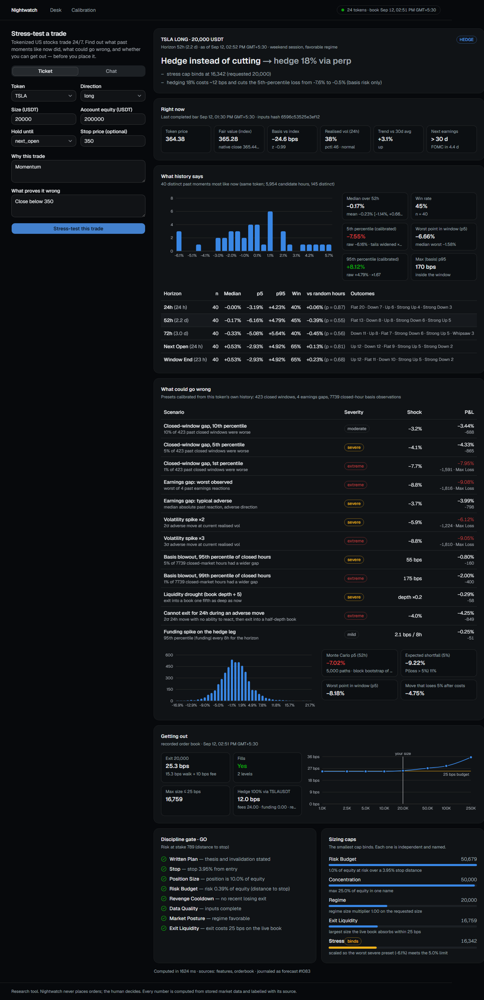
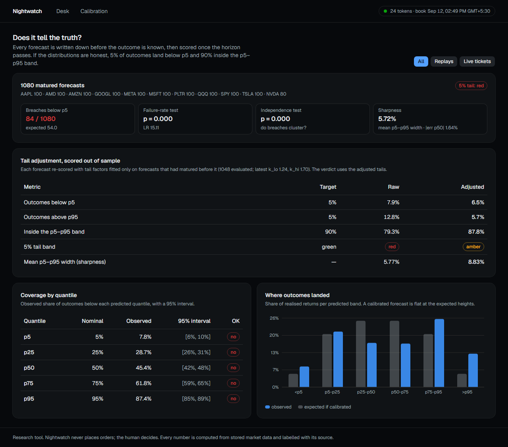

# Nightwatch

**Stress-test a tokenized-US-stock trade before you place it.**

US stocks trade 6.5 hours a day. Tokenized versions of them (rTokens) trade 24/7. The
dangerous window is the one where only the token can move: nights, weekends, holidays —
when news lands and the real market is shut.

Nightwatch takes a trade idea in plain language and answers four questions with data:

1. **What happened before?** It finds the past moments that looked like now — same
   volatility, same gap between token and fair value, same time-of-week, same distance to
   earnings — and shows what followed, with sample sizes and confidence intervals.
2. **What could go wrong?** Preset stress tests built from real token data: weekend gap,
   earnings gap, volatility spike, token-vs-fair-value blowout, liquidity drought, exchange
   halt.
3. **Can you get out?** It walks the live order book for your size and tells you the real
   cost of exiting.
4. **How big, then?** A sized verdict — go, reduce, hedge with the perpetual, or don't —
   with every number traceable to its source.

The human makes the decision. Nightwatch never places orders.



Every forecast is journaled before its outcome is known and scored when the horizon
passes. The calibration page shows whether the stated probabilities hold up, and what
the tail adjustment fitted on earlier forecasts does to later ones.



## Run it

Python 3.11+ and Node 22+. Everything below works without any API key; only the
plain-language chat needs `ANTHROPIC_API_KEY`.

```bash
# 1. Python environment
uv venv .venv --python 3.11
uv pip install --python .venv/Scripts/python.exe -e ".[api,dev]"   # macOS/Linux: .venv/bin/python

# 2. Data: resolve the universe, backfill history (resumable; hours for 24 tokens), calendars, news
nightwatch universe
nightwatch sync --core
nightwatch calendars
nightwatch news

# 3. Keep it fresh: order books every minute, bars/calendars/news on their own cadence
nightwatch record

# 4. API and web desk
uvicorn nightwatch.api.app:app --port 8000
cd web && npm ci && cp .env.local.example .env.local && npm run build && npm start   # http://localhost:3000
```

Or with containers: `docker compose up -d` after seeding the database (see `docs/deploy.md`).

### From the terminal

```bash
nightwatch analyze TSLA --side long --notional 20000 --equity 100000 --stop 350
nightwatch replay --tickers TSLA --max-points 100     # score past closed-market windows
nightwatch calibration --kind replay                   # does it tell the truth?
nightwatch status
```

### Tests

```bash
.venv/Scripts/python.exe -m pytest
```

## Layout

| path | what |
|---|---|
| `nightwatch/data` | Bitget, Yahoo, Nasdaq, FRED, RSS clients; SQLite store; sync |
| `nightwatch/features` | session calendar, basis, regime, event features, point-in-time snapshots |
| `nightwatch/analog` | analog retrieval, forward outcomes, cohort statistics, random baseline |
| `nightwatch/stress` | data-calibrated presets, block-bootstrap Monte Carlo, reverse stress |
| `nightwatch/execution` | order-book walk, exit cost curve, perp hedge economics |
| `nightwatch/decision` | trade ticket, rule gate, sizing caps, verdict |
| `nightwatch/journal` | forecast journal, calibration tests, replay, tail adjustment |
| `nightwatch/api` | FastAPI app and the language layer |
| `web` | Next.js desk |
| `docs` | research notes, deployment |
