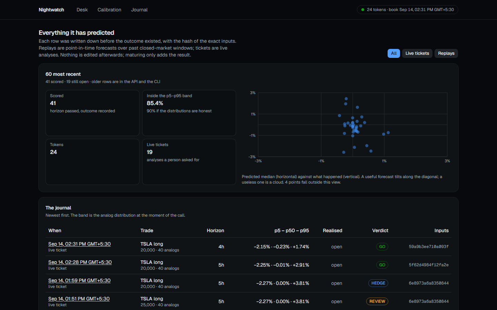

# Nightwatch

**Stress-test a tokenized-US-stock trade before you place it.**

US stocks trade 6.5 hours a day. Tokenized versions of them (rTokens) trade 24/7. The
dangerous window is the one where only the token can move: nights, weekends, holidays —
when news lands and the real market is shut.

Nightwatch takes a trade idea in plain language — typed as a sentence or filled into a
form — and answers four questions with data:

1. **What happened before?** It finds the past moments that looked like now — same
   volatility, same gap between token and fair value, same time-of-week, same distance to
   earnings — and shows what followed, with sample sizes and confidence intervals.
2. **What could go wrong?** Preset stress tests built from real token data: weekend gap,
   earnings gap, volatility spike, token-vs-fair-value blowout, liquidity drought, exchange
   halt.
3. **Can you get out?** It walks the live order book for your size and tells you the real
   cost of exiting.
4. **How big, then?** A sized verdict — go, reduce, hedge with the perpetual, or don't —
   with every number traceable to its source.

Then it argues against its own answer, using the same numbers, and tells you what would
have to change for the verdict to be different: how big you could go, how far your stop
could sit, and where the answer flips.

The human makes the decision. Nightwatch never places orders.

**Live:** https://nightwatch-gules.vercel.app


It also keeps track of the things a single trade cannot see:

* **Your book.** Given what you already hold, it measures the correlation from the tokens'
  own history and says which position actually carries the bad case, rather than assuming
  three names are three bets.
* **Your record.** Trades you mark as taken feed daily, weekly and monthly loss limits.
  Past them, the gate refuses the next ticket whatever it looks like.
* **What happened last time.** Every matured forecast gets a plain sentence and comes back
  the next time conditions look similar.
* **What the book looks like at other hours.** The recorder snapshots every order book
  every minute, because nobody publishes how deep a tokenized stock is at 3 a.m. on a
  Sunday.
* **Where the numbers came from.** Six live feeds — Bitget, Yahoo, Nasdaq, FRED, RSS and
  SEC EDGAR — each listed on the desk with when it was last pulled and the newest thing in
  it. Filings are timed to the second EDGAR accepted them, because most 8-Ks land after
  the US close, when the stock cannot react and the token can.
* **A link you can send someone.** Every analysis keeps its full report, so `/r/<id>`
  reopens that exact verdict — same analogs, same stress table, same book, same hash of
  the inputs, nothing recomputed.

## Does it work?

Every forecast is journaled before its outcome is known and scored when the horizon
passes, so the page below is not a claim, it is a scorecard. Three findings from it, the
uncomfortable one included:

* **The raw tails were wrong.** Across 2,345 scored replays, 8.5% of outcomes fell below
  the stated 5th percentile instead of 5%. Factors fitted only on already-matured
  forecasts bring that to 5.6% out of sample, which moves the tail light from red to
  amber — most of the way, not all of it, and the page says which.
* **The analogs do not predict direction.** Scored against random hours of the same kind,
  they are indistinguishable over the distribution as a whole. Where they win is the loss
  tail: 8.4% of outcomes below their 5th percentile against 10.2% below the random one.
  That is the only claim this product makes.
* **The macro layer earned its place by measurement**, on the third and largest test of
  it: 1,605 paired forecasts, a 1.3% lower forecast loss, interval excluding zero. The two
  smaller tests before it showed nothing, and the notes say so.

The full write-up is in [docs/research-notes.md](docs/research-notes.md).


Every call it has made, and how each one turned out:



## Run it

Python 3.11+ and Node 22+. Everything works without any API key, including the
plain-language chat, which falls back to a rule-based parser and briefing. Set
`ANTHROPIC_API_KEY` to have Claude handle the conversation instead.

```bash
# 1. Python environment
uv venv .venv --python 3.11
uv pip install --python .venv/Scripts/python.exe -e ".[api,dev]"   # macOS/Linux: .venv/bin/python

# 2. Data: resolve the universe, backfill history (resumable; hours for 24 tokens), calendars, news
nightwatch universe
nightwatch sync --core
nightwatch calendars
nightwatch news

# 3. Keep it fresh: order books every minute, bars/calendars/news on their own cadence
nightwatch record

# 4. API and web desk
uvicorn nightwatch.api.app:app --port 8000
cd web && npm ci && cp .env.local.example .env.local && npm run build && npm start   # http://localhost:3000
```

Or with containers: `docker compose up -d` after seeding the database (see `docs/deploy.md`).

### From the terminal

```bash
nightwatch analyze TSLA --side long --notional 20000 --equity 100000 --stop 350
nightwatch replay --tickers TSLA --max-points 100     # score past closed-market windows
nightwatch calibration --kind replay                   # does it tell the truth?
nightwatch status
```

### Tests

```bash
.venv/Scripts/python.exe -m pytest
```

## Layout

| path | what |
|---|---|
| `nightwatch/data` | Bitget, Yahoo, Nasdaq, FRED, RSS, SEC EDGAR clients; SQLite store; sync |
| `nightwatch/features` | session calendar, basis, regime, event features, point-in-time snapshots |
| `nightwatch/analog` | analog retrieval, forward outcomes, cohort statistics, random baseline |
| `nightwatch/stress` | data-calibrated presets, block-bootstrap Monte Carlo, reverse stress |
| `nightwatch/execution` | order-book walk, exit cost curve, perp hedge economics |
| `nightwatch/decision` | trade ticket, rule gate, sizing caps, verdict |
| `nightwatch/journal` | forecast journal, calibration tests, replay, tail adjustment |
| `nightwatch/api` | FastAPI app and the language layer |
| `web` | Next.js desk |
| `docs` | research notes, deployment |
