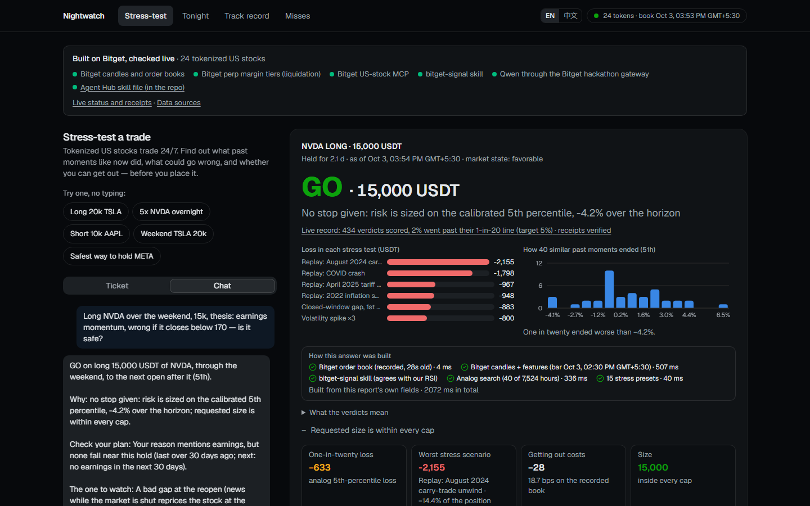

# Nightwatch

**Stress-test the trade before you place it.**
A pre-trade desk for tokenized US stocks (rTokens) on Bitget.

[](https://github.com/Ritik200238/nightwatch/actions/workflows/ci.yml)
[](https://github.com/Ritik200238/nightwatch/actions/workflows/uptime.yml)
[](https://github.com/Ritik200238/nightwatch/actions/workflows/browser-smoke.yml)
· Live: https://nightwatch-gules.vercel.app



## What it does

US stocks trade 6.5 hours a day; their tokenized versions (rTokens) trade 24/7. The
dangerous window is the one where only the token can move: nights, weekends, holidays.
Nightwatch shows what followed past moments like yours, stress-tests the trade, prices your
exit on Bitget's live order book, and gives a sized verdict — GO, REDUCE TO, HEDGE, REVIEW
or NO GO. Every verdict is journaled, hash-chained and scored in public. It never places
orders.

You type a trade in plain language (English or 中文), or fill a form, and it answers four
questions:

1. **What happened before?** The past moments that looked like now (same volatility, same
   gap between token and fair value, same liquidity, same distance to earnings and the Fed),
   with sample sizes and confidence intervals.
2. **What could go wrong?** Stress tests fitted from the token's own history, taken from
   the tail that hurts your side, plus replays of five market breaks (COVID, 2022, March
   2023, August 2024, April 2025).
3. **Can you get out?** It walks the live order book for your size and prices the exit.
4. **How big, then?** A sized verdict, with every number traceable to its source, and what
   would have to change for it to flip.

More (leverage and liquidation price, your whole book, the AI analyst, shorts, links you
can send): [docs/features.md](docs/features.md).

## Try it

* **Live desk:** https://nightwatch-gules.vercel.app
* Demo video: (link added at submission)
* **From your AI tool** (read-only MCP server; tools `stress_test`, `list_conditions`,
  `list_tokens`):

```bash
claude mcp add nightwatch --transport http https://nightwatch-gules.vercel.app/api/mcp
```

* **As an Agent Hub-style skill**, [`skills/nightwatch-stress-test`](skills/nightwatch-stress-test/SKILL.md),
  the step that runs before an order is drafted:

```bash
mkdir -p ~/.claude/skills/nightwatch-stress-test
curl -fsSL https://raw.githubusercontent.com/Ritik200238/nightwatch/main/skills/nightwatch-stress-test/SKILL.md \
  -o ~/.claude/skills/nightwatch-stress-test/SKILL.md
```

## Proof

Figures as of 3 Oct 2026.

| Claim | How you can check it yourself |
|---|---|
| Every live verdict is on the record, unedited | [`/api/verify`](https://nightwatch-gules.vercel.app/api/verify) recomputes the receipt chain (712 checked, no break); [`/api/anchors`](https://nightwatch-gules.vercel.app/api/anchors) has the daily Bitcoin timestamps (4 of 4 in Bitcoin; check a `.ots` proof at opentimestamps.org) |
| The one-in-twenty loss (the 5th percentile) holds out of sample | [`/calibration`](https://nightwatch-gules.vercel.app/calibration), recomputed from the journal: 2,779 scored forecasts, raw breach rate 7.5% (red), 4.8% with factors fitted only on earlier forecasts (green) |
| We publish our misses and our mistakes | [`/wrong`](https://nightwatch-gules.vercel.app/wrong): 124 of 2,301 replays and 8 of 433 live tickets went past the line |
| Studies of the method, corrected for asking eleven questions | [`/studies`](https://nightwatch-gules.vercel.app/studies) |
| Not verified by us | real-trader adoption; directional edge (measured: none) |

## How it works

* **Data:** six data feeds plus two Bitget AI services. Feeds: Bitget (candles, order books
  every 30 s, funding, margin tiers), Yahoo, Nasdaq, FRED, RSS and SEC EDGAR. Bitget AI
  services: the US-stock data server and the signal skill backend; `/sources` shows what
  each last delivered.
* **Engine:** retrieve analogs (the past moments like now), compute what followed over the
  same hold, run fitted stress scenarios and crash replays, walk the order book, then size
  through a rule gate (concentration, risk budget, liquidation, your own loss limits).
  Tail widths are corrected by factors fitted only on earlier, already-scored forecasts.
* **AI layer:** an *analyst* reads the finished report and says what matters most; an
  *agent* turns plain language into the trade and answers follow-ups; a *guard* checks
  every figure either quotes against the report and removes any sentence citing one that is
  not there. The AI cannot move a number.

## Findings

Three of the most surprising, failures included. The full set is in
[docs/features.md](docs/features.md) and [docs/research-notes.md](docs/research-notes.md).

* **Closer is not tighter.** The near half of a retrieval is 13% wider by standard
  deviation and 19% by interquartile range, and only 1 of 24 tokens goes the other way
  (clustered t = −6.2, n = 958). So weighting close matches more made the forecast worse,
  and we did not ship it.
* **Shorts were sized on the wrong tail, and that is fixed.** A short was stress-tested and
  sized on the tail that is a gain for it (a TSLA short's "1-in-100 gap" read +7.4%).
  Presets now use the side that hurts: the same short reads −6.8%.
* **Asking eleven questions makes a lucky yes likely.** Five came back no, three could not
  be decided, three said yes — and after correcting for false discoveries (Benjamini–Hochberg,
  5%) only 1 of the 3 yes answers survives: a model reading an SEC filing does pick the ones
  that move the price (q = 0.004). The pitch is the loss tail, not direction: no directional
  edge was found. One tail factor also hid two opposite errors, 1.8% breaches on multi-day
  holds cancelling 6.2% overnight; fitting per holding period fixed it.


<details>
<summary>Run locally</summary>

Python 3.11+ and Node 22+. Everything works without any API key (a rule-based parser and
briefing stand in); set `ANTHROPIC_API_KEY` to have Claude handle the conversation.

```bash
uv venv .venv --python 3.11
uv pip install --python .venv/Scripts/python.exe -e ".[api,dev]"   # macOS/Linux: .venv/bin/python

nightwatch universe && nightwatch sync --core    # resumable; hours for 24 tokens
nightwatch calendars && nightwatch news
nightwatch record                                 # order books every minute, the rest on cadence

uvicorn nightwatch.api.app:app --port 8000
cd web && npm ci && cp .env.local.example .env.local && npm run build && npm start   # :3000
```

Containers: `docker compose up -d` after seeding the database (see [docs/deploy.md](docs/deploy.md)).

```bash
nightwatch analyze TSLA --side long --notional 20000 --equity 100000 --stop 350
nightwatch replay --tickers TSLA --max-points 100
nightwatch calibration --kind replay
nightwatch status
.venv/Scripts/python.exe -m pytest
```

</details>

## Repo layout

| path | what |
|---|---|
| `nightwatch/data` | Bitget, Yahoo, Nasdaq, FRED, RSS, SEC EDGAR clients; SQLite store; sync |
| `nightwatch/features` | session calendar, basis, regime, event features, point-in-time snapshots |
| `nightwatch/analog` | retrieval of past moments like now, forward outcomes, cohort statistics, random baseline |
| `nightwatch/stress` | fitted presets, block-bootstrap Monte Carlo, reverse stress |
| `nightwatch/execution` | order-book walk, exit cost curve, perp hedge economics |
| `nightwatch/decision` | trade ticket, rule gate, sizing caps, verdict |
| `nightwatch/journal` | forecast journal, calibration tests, replay, tail adjustment |
| `nightwatch/api` | FastAPI app and the language layer |
| `web` | Next.js desk |
| `skills` | the Agent Hub-style skill |

Docs: [features, Bitget integration and numbers](docs/features.md) ·
[research notes](docs/research-notes.md) · [plain-language explainer](docs/nightwatch-explained.md) ·
[submission](docs/submission.md) · [demo script](docs/demo-script.md) · [deployment](docs/deploy.md)
