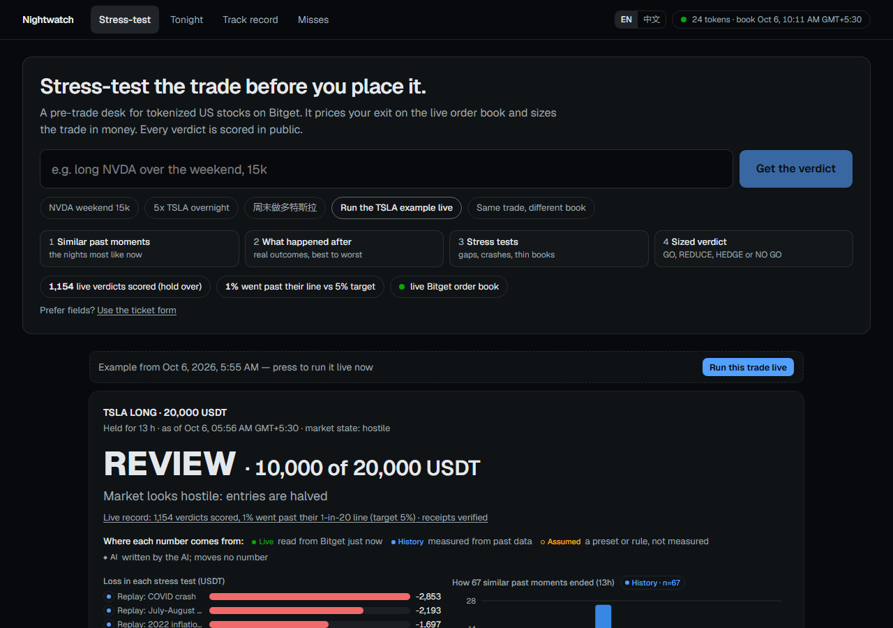
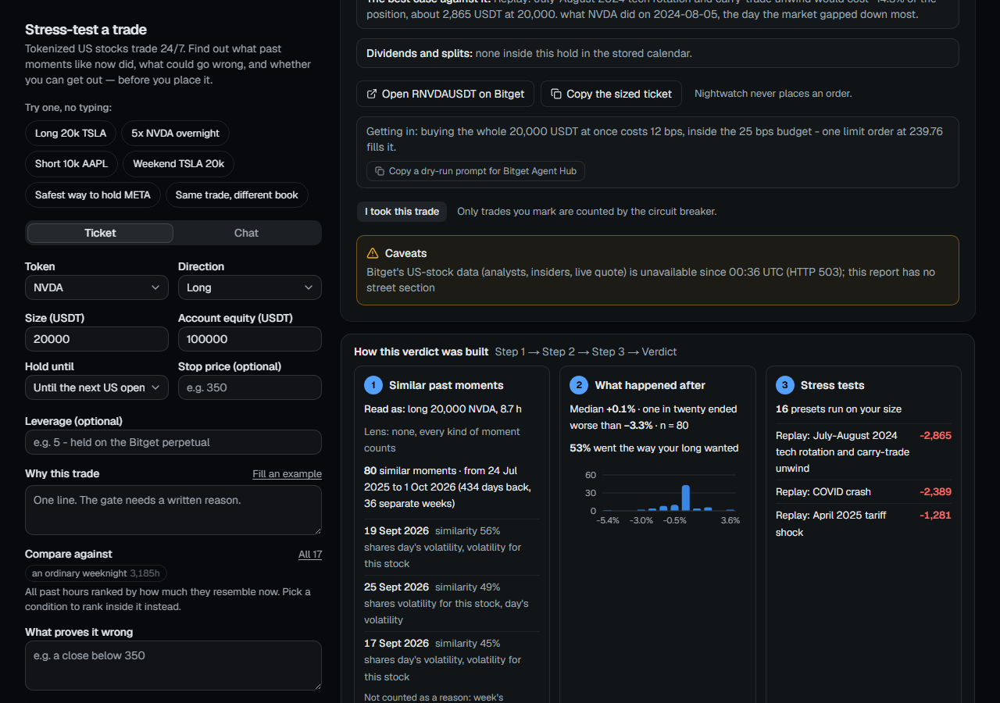
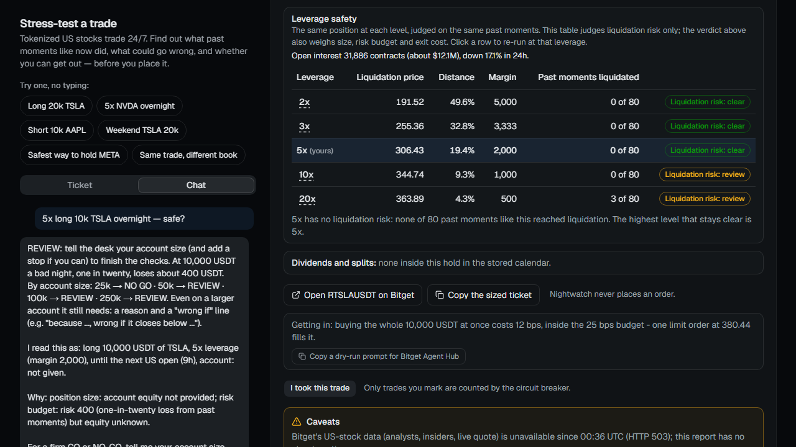
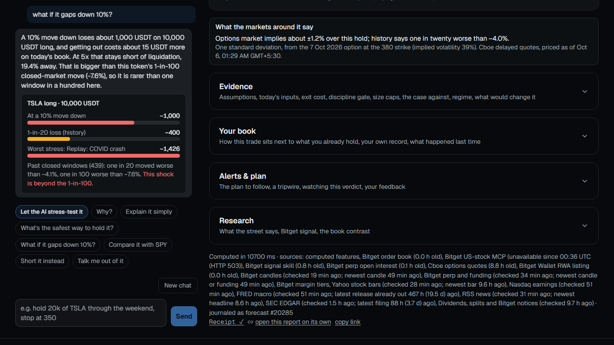
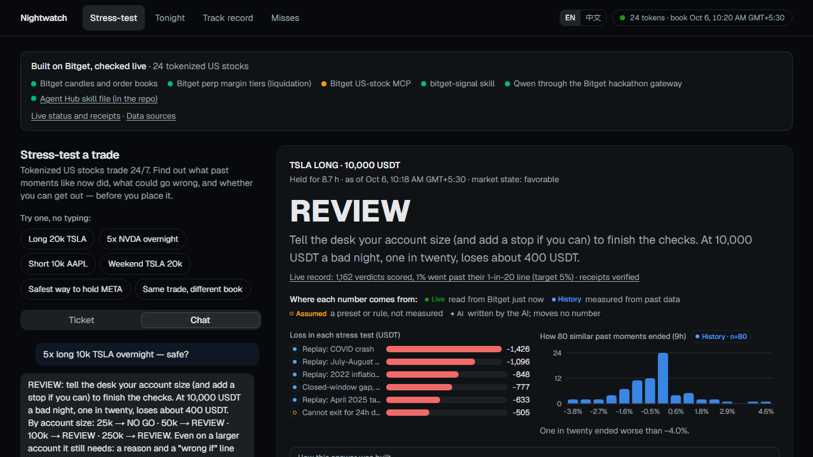
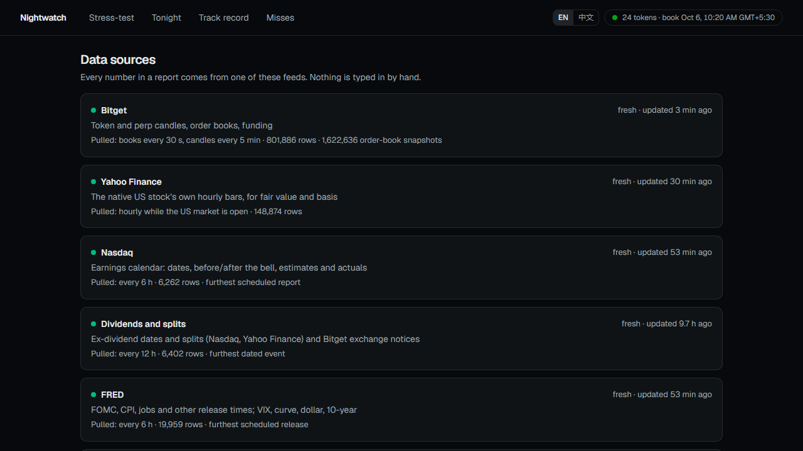
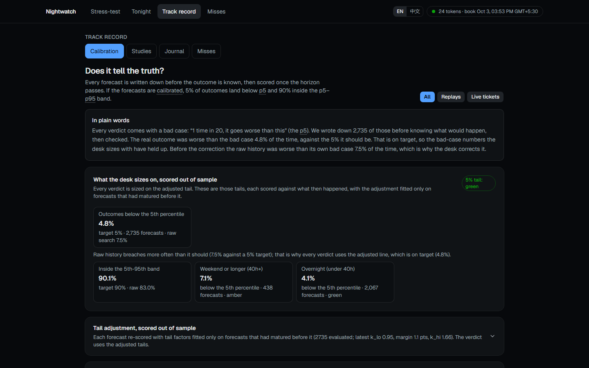

# Nightwatch

### Stress-test the trade before you place it.

A pre-trade desk for tokenized US stocks (rTokens) on Bitget — built for the hours a normal
stock tool goes blind: nights, weekends, holidays, the window where only the token moves.

[](https://github.com/Ritik200238/nightwatch/actions/workflows/ci.yml)
[](https://github.com/Ritik200238/nightwatch/actions/workflows/uptime.yml)
[](https://github.com/Ritik200238/nightwatch/actions/workflows/browser-smoke.yml)
[](https://github.com/Ritik200238/nightwatch/actions/workflows/ci.yml)

**Live desk → https://nightwatch-gules.vercel.app**

<p align="center">
  
</p>

---

## The pitch in one sentence

Type a trade in plain English or 中文 → Nightwatch finds the real past moments like it,
shows what happened after them, stress-tests it against real crashes, prices your exit on
Bitget's live order book, and gives you a sized verdict — **GO, REDUCE TO, HEDGE, REVIEW,
or NO GO.** Every verdict is written down, hash-chained, and scored against reality in
public. It never places an order; the human decides.

That is exactly the sub-theme's own definition: *"before opening a position, AI retrieves
historically similar scenarios → historical distribution → preset stress tests."* You can
see all three steps, in order, on one screen, in under 60 seconds.

<p align="center">
  
</p>

---

## Why this is different from "an AI chatbot that talks about stocks"

| | Most AI trading bots | Nightwatch |
|---|---|---|
| Past moments | Vibes, or nothing | Real retrieval: named dates, a similarity score, what each one shares and differs on — [not hidden behind a claim](#the-honest-parts-we-could-have-hidden) |
| Stress tests | Generic, same for every trade | Fitted from the token's own history, sized to *your* position, scaled to *your* hold length, taken from the tail that actually hurts *your* side |
| The verdict | A vibe ("looks bullish!") | A number: GO / REDUCE TO X / HEDGE Y% / REVIEW / NO GO, with every figure traceable to a source |
| Getting out | Never mentioned | Walks Bitget's **live order book** for your exact size and prices the real exit cost |
| Leverage | Ignored | A full liquidation table, 2×–20×, each level checked against the same real history |
| Track record | Marketing copy | A public, scored, hash-chained, Bitcoin-anchored record you can recompute yourself — see below |
| When it's wrong | Not shown | Published, on purpose, at [`/wrong`](https://nightwatch-gules.vercel.app/wrong) |

---

## See it work

**1. Ask it anything, in plain words.** English, 中文, messy phrasing, leverage, stops,
holdings you already have — it reads the trade, tells you what it understood ("I read this
as…"), and runs the full chain.

**2. It checks your own reasoning.** Give it a reason ("because Nvidia hit record highs,
wrong if it closes below 170") and it holds that claim against real news headlines and SEC
filings stored *before* the report — "in the news," "the news says otherwise," or "not in
our feeds," every quote a real stored headline with a link.

**3. Leverage gets a real safety table**, not a single scary number — every level from 2×
to 20×, same position, same past moments, so you can see exactly where liquidation risk
turns from clear to reviewable.

<p align="center">
  
</p>

**4. Follow-ups are instant and literal — not a new chat.** "What if it gaps down 10%?"
re-runs the exact report against that shock, in under a second, with a chart:

<p align="center">
  
</p>

Notice the footer in that screenshot — **every number on that answer is traced to the exact
feed and how old it is**, down the millisecond. That line is generated from the real
pipeline, not written by hand.

---

## Built on Bitget, not just *mentioned* on Bitget

<p align="center">
  
</p>

Every green dot in that strip is a live, working Bitget integration, clickable, checked
against reality on every report:

* **Bitget spot & perp candles, funding, and order books** — pulled every 30 s, 1.6M+ order-book
  snapshots recorded and counting. This *is* the price data the whole product runs on.
* **Bitget perp margin tiers** — real liquidation math, not a guessed maintenance margin.
* **Bitget's US-stock data MCP server** — live quotes, analyst targets, insider trades,
  fundamentals, dividends, calendar, consensus estimates, and sentiment, called directly.
* **Bitget perp open interest** — a crowded-trade flag on every leveraged report.
* **Bitget Wallet RWA listing status** — is the token even tradable right now.
* **bitget-signal skill** — an independent technical-analysis skill cross-checked against
  our own numbers.
* **Qwen 3.8 Max through Bitget's own hackathon gateway** — the language layer.
* **An Agent Hub-style skill file, shipped in this repo** ([`skills/nightwatch-stress-test`](skills/nightwatch-stress-test/SKILL.md)) —
  the pre-trade check any agent can call before drafting an order.
* **A read-only MCP server of our own** (`stress_test`, `list_conditions`, `list_tokens`) —
  so any AI tool can ask Nightwatch the same question a human would:

  ```bash
  claude mcp add nightwatch --transport http https://nightwatch-gules.vercel.app/api/mcp
  ```

Plus Yahoo, Nasdaq, FRED, SEC EDGAR, RSS news, and Cboe options data — **21 distinct data
sources in total**, every one live, every one listed with its real freshness on
[`/sources`](https://nightwatch-gules.vercel.app/sources):

<p align="center">
  
</p>

---

## The proof (recompute it yourself — nothing here is a screenshot of a claim)

Figures as of 6 Oct 2026. Pulled live from the production API — this whole block is
rewritten by a script (`nightwatch proof-sync`) that reads the same endpoints linked
below, so it can't drift from what the site shows.

| Claim | The real number, right now | Check it yourself |
|---|---:|---|
| Every live verdict is on the record, unedited | **(1,460 checked, no break, as of 6 Oct 2026)** | [`/api/verify`](https://nightwatch-gules.vercel.app/api/verify) recomputes the whole hash chain live |
| Anchored to something we can't fake | **(7 of 7 in Bitcoin; verify a `.ots` proof at opentimestamps.org)** | [`/api/anchors`](https://nightwatch-gules.vercel.app/api/anchors) |
| The "1-in-20 bad case" line roughly holds | **3,369 scored forecasts (140 independent nights; resampling whole nights the interval is 2.3% to 4.9%), raw breach rate 4.8% (green), 3.5% with factors fitted only on earlier forecasts (green), as of 6 Oct 2026** | [`/calibration`](https://nightwatch-gules.vercel.app/calibration), recomputed live |
| We publish our own misses | **104 of 2,131 replays and 12 of 1,168 live tickets (6 distinct events) went past the line (as of 6 Oct 2026)** | [`/wrong`](https://nightwatch-gules.vercel.app/wrong) — every one of them, listed |
| We test the method itself, not just the trades | **11 internal studies: 3 yes, 5 no, 3 unclear** (a 12th study, against a random-hours baseline, is built and merged but has not yet run on production) | [`/studies`](https://nightwatch-gules.vercel.app/studies), corrected for multiple testing |
| Universe coverage | **24 tokenized US stocks live now** (a 112-ticker expansion is built and tested, not yet deployed) | [`/api/universe`](https://nightwatch-gules.vercel.app/api/universe) |
| Not verified by us | real-trader adoption; directional edge (measured: **none**) | — said plainly, not hidden |

<p align="center">
  
</p>

### The honest parts we could have hidden

This is the part most entries skip, and it's the part that actually proves the numbers are
real:

* **p50/p75/p95 bands are flagged outside their confidence interval on the live page** —
  we show it anyway, instead of quietly fixing the display.
* **One internal study says our retrieval is "not proven" to beat picking a random past
  hour** (closer in 45% of 2,280 pairs) — tagged on the track-record page itself, in
  amber, not buried in a changelog.
* **"Closer is not tighter."** We measured that weighting near-identical past moments more
  heavily made the forecast *worse* (clustered t = −6.2, n = 958) — and shipped the version
  that doesn't do that, instead of the version that looked cleverer.
* **A short used to be stress-tested on the wrong tail** (a gain, not a loss) — found,
  written up, and fixed; the fix is in the commit history, not erased.
* **Multiple-testing correction, applied to ourselves.** Eleven of twelve studies started as
  "yes" candidates; after Benjamini–Hochberg correction at 5%, only the ones that survive are
  called findings. The rest say "no" or "unclear," on the page, in public.

If a judge can break a claim, we would rather have broken it first and said so.

---

## The AI's job — and the line it is not allowed to cross

Bitget's own lesson from last season: *"LLMs are not fortune-tellers, but analysts."*
Nightwatch holds that literally:

* **An *analyst*** reads the finished, fully-computed report and says what matters most and
  what would change its mind — connecting facts, never inventing one.
* **An *agent*** turns a messy sentence into a structured trade, runs a bounded loop of real
  tool calls (the same engine a human would trigger), and answers follow-ups.
* **A *guard*** checks every number the AI writes against the report it was given. A
  sentence citing a number that isn't there gets deleted before you ever see it — and we
  log that it happened.

**The AI never computes a price, a percentile, a liquidation level, or a verdict.** Every
number on every page comes from deterministic code that is tested, versioned, and frozen
(`method-freeze-2`, see [`nightwatch/journal/method_freeze.json`](nightwatch/journal/method_freeze.json)) before it is ever
scored against reality. The AI's only job is to read, explain, and translate — the job it's
actually good at.

---

## Talk to it however you want

* **Web desk** — https://nightwatch-gules.vercel.app, live progress steps streamed while it
  thinks, chat cards under every follow-up, English and 中文.
* **Telegram bot** — ships in this repo, switches on when `TELEGRAM_BOT_TOKEN` is set. Say
  the trade in plain words ("long 20k NVDA over the weekend", "周末做多特斯拉 2万U") and get
  the same sized verdict the site gives.
* **Any AI tool, via MCP** (read-only; `stress_test`, `list_conditions`, `list_tokens`):

  ```bash
  claude mcp add nightwatch --transport http https://nightwatch-gules.vercel.app/api/mcp
  ```

* **As an Agent Hub-style skill**, the pre-trade check that runs *before* an order is
  drafted:

  ```bash
  mkdir -p ~/.claude/skills/nightwatch-stress-test
  curl -fsSL https://raw.githubusercontent.com/Ritik200238/nightwatch/main/skills/nightwatch-stress-test/SKILL.md \
    -o ~/.claude/skills/nightwatch-stress-test/SKILL.md
  ```

---

## How it works, end to end

1. **Retrieve.** Search the token's own hourly history (and pool across all 24 tokens when
   one token's own history is too thin to answer a specific condition) for moments that
   genuinely resemble now — matched on volatility state and the shape of the hold, not on
   features that happen to look the same across the whole market.
2. **Distribute.** Compute what actually followed those moments over the exact same hold —
   median, 1-in-20, sample size, confidence interval, and the share that went your way.
3. **Stress-test.** Run presets fitted from the token's *own* history (weekend gap,
   earnings gap, volatility spike, token-vs-fair-value blowout, a thin book, being stuck
   unable to exit), scaled to how many closed windows your hold actually crosses — plus
   real crash replays (COVID, the 2022 inflation shock, March 2023 bank failures, the
   August 2024 carry-trade unwind, the April 2025 tariff shock) and what the *options
   market itself* is pricing for the same window.
4. **Price the exit.** Walk Bitget's live order book for your exact size.
5. **Size it.** A rule gate — concentration, risk budget, liquidation, your own loss
   limits, a written "why" and "what proves me wrong" — decides the verdict. Every tail
   width is corrected by factors fit **only on earlier, already-scored forecasts** — never
   on the forecast being judged.
6. **Watch it.** Arm a price tripwire, save a pre-commit plan ("if X happens, cut half"),
   or let the desk re-check the verdict at the next close. Every verdict gets a permanent,
   shareable link.

Full technical writeup: [docs/features.md](docs/features.md) · [docs/submission.md](docs/submission.md)

<details>
<summary><b>Run it yourself (no API key required)</b></summary>

Python 3.11+ and Node 22+. Everything works with zero API key — a rule-based parser and
briefing stand in for the language model; set `ANTHROPIC_API_KEY` to turn on Claude for the
conversation layer.

```bash
uv venv .venv --python 3.11
uv pip install --python .venv/Scripts/python.exe -e ".[api,dev]"   # macOS/Linux: .venv/bin/python

nightwatch universe && nightwatch sync --core    # resumable; hours for 24 tokens
nightwatch calendars && nightwatch news
nightwatch record                                 # order books every minute, the rest on cadence

uvicorn nightwatch.api.app:app --port 8000
cd web && npm ci && cp .env.local.example .env.local && npm run build && npm start   # :3000
```

Containers: `docker compose up -d` after seeding the database (see [docs/deploy.md](docs/deploy.md)).

```bash
nightwatch analyze TSLA --side long --notional 20000 --equity 100000 --stop 350
nightwatch replay --tickers TSLA --max-points 100
nightwatch calibration --kind replay
nightwatch status
.venv/Scripts/python.exe -m pytest     # 1,000+ tests
```

</details>

---

## Repo layout

| path | what |
|---|---|
| `nightwatch/data` | Bitget, Yahoo, Nasdaq, FRED, RSS, SEC EDGAR, Cboe, corporate-events clients; SQLite store; sync |
| `nightwatch/features` | session calendar, basis, regime, event features, Bitget MCP data, point-in-time snapshots |
| `nightwatch/analog` | retrieval of past moments like now, forward outcomes, cohort statistics, random baseline |
| `nightwatch/stress` | fitted presets, block-bootstrap Monte Carlo, reverse stress, crash replays |
| `nightwatch/execution` | order-book walk, exit cost curve, perp hedge economics |
| `nightwatch/decision` | trade ticket, rule gate, sizing caps, thesis-vs-news check, verdict |
| `nightwatch/journal` | forecast journal, calibration tests, replay, tail adjustment, receipts |
| `nightwatch/api` | FastAPI app, the language layer, the MCP server |
| `web` | Next.js desk |
| `skills` | the Agent Hub-style skill |

Docs: [features, Bitget integration and numbers](docs/features.md) ·
[research notes](docs/research-notes.md) · [plain-language explainer](docs/nightwatch-explained.md) ·
[submission](docs/submission.md) · [demo script](docs/demo-script.md) · [deployment](docs/deploy.md) ·
[full product overview](Overview.md)

---

**Research tool. Nightwatch never places orders; the human decides. Every number is
computed from stored market data and labelled with its source.**
